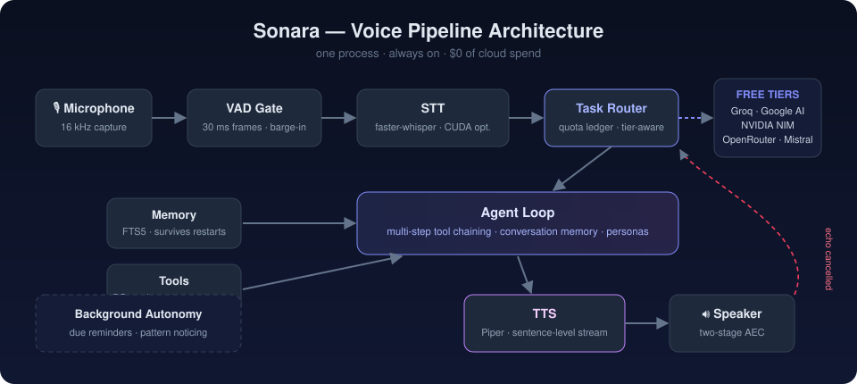
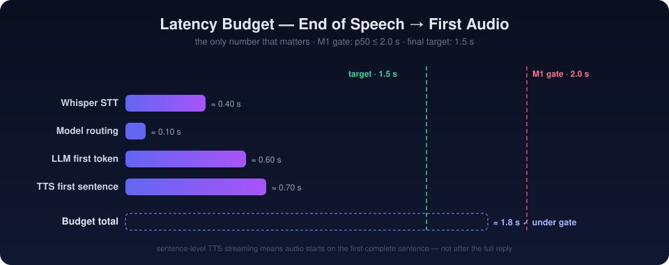
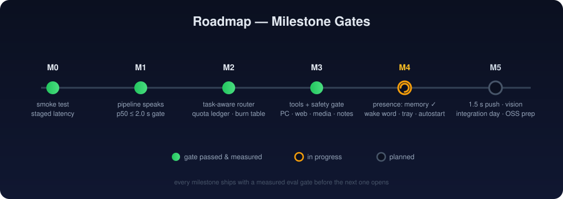

# Sonara

[](https://www.python.org)
[](https://microsoft.com)
[](#the-router)
[](https://github.com/SYSTRAN/faster-whisper)
[](https://github.com/rhasspy/piper)
[](#free-tier-strategy)

> **"Hey Sonara."** A local-first, always-on voice assistant. It listens without being launched,
> answers without a key press, and is still there an hour later — powered entirely by free
> cloud tiers and local models.

**$0 of cloud spend. Forever.**

---

## What is Sonara?

Most voice assistants are demos: run a script, say one sentence, get one reply, repeat. Sonara is a
**resident** — a single process that stays alive, listens continuously with voice activity detection,
and behaves like software that lives on your machine:

- **Conversational first** — not every sentence is forced through a tool; it talks like a person.
- **Persistent memory** — remembers across restarts and opens by telling you where you left off.
- **Proactive** — volunteers reminders when they come due, notices repeated actions, offers to learn them.
- **Personalities as config** — four personas, tuned by ear.
- **Hands** — multi-step tool chaining for PC control, notes, web search, and media.
- **Honest** — refuses to bluff; if it doesn't know or data is thin, it says so.

## Pipeline at a Glance

| | |
|---|---|
|  | The full loop: VAD-gated capture → faster-whisper STT → task-aware router → agent loop with tools & memory → sentence-streamed Piper TTS → two-stage echo cancellation. |

## The Router

The heart of Sonara is a **task-aware model router**. Every request is classified by task type and
routed to the cheapest free tier that can handle it well — with a quota ledger tracking burn per
provider, hard timeouts, and graceful degradation to whatever tier is reachable.

| Provider | Key | Role |
|---|---|---|
| **Groq** | `GROQ_API_KEY` | fast conversational + reasoning tiers |
| **Google AI Studio** | `GOOGLE_AI_STUDIO_KEY` | long-context tasks |
| **NVIDIA NIM** | `NVIDIA_NIM_KEY` | one-time trial credits, measured routing |
| **OpenRouter** | `OPENROUTER_KEY` | fallback pool (paid proxies blocked) |
| **Mistral** | `MISTRAL_API_KEY` | additional free tier |

A provider with no key is skipped, not an error — Sonara degrades to whatever it can reach. Routing decisions are **made by measurement**, not vibes: broad eval harnesses score each model per task family, and the router picks winners from data.

## Latency

The number that matters: **end-of-speech → first audio out of the speaker.**

| | |
|---|---|
|  | Sentence-level TTS streaming means audio starts on the first complete sentence. M1 gate: p50 ≤ 2.0 s over 50 exchanges. Final target: 1.5 s. |

Engineering that went into this budget:

- **Two-stage acoustic echo cancellation** — measured 7 dB improvement with numpy AEC alone, judged insufficient, upgraded to a two-stage pipeline reaching 22–33 dB — making barge-in viable at normal playback volume.
- **GPU STT on Windows** — faster-whisper via cuBLAS/cuDNN (optional extra); CPU fallback measured 1.5 s cold and degraded under sustained load.
- **Prompt compression in the router** — sized to where the tokens actually are.
- **Microphone priming** — the first 300 ms before VAD fires is kept in preroll, so the first word is never lost.

## Roadmap

Every milestone ships with a **measured eval gate** before the next opens — no milestone is done because it feels done.

| | |
|---|---|
|  | M0–M3 gates passed (pipeline speaks, router live, tools shipped). M4 presence in progress: memory done, wake word / tray / autostart next. |

| Milestone | Scope | Gate |
|---|---|---|
| **M0** ✅ | Staged smoke test: record → STT → LLM → TTS, every stage timed | all stages green |
| **M1** ✅ | The pipeline speaks: push-to-talk loop, latency logger | p50 ≤ 2.0 s over 50 exchanges, zero self-interruptions over 20 playback turns |
| **M2** ✅ | LiteLLM-style router + quota ledger + burn table + degradation modes | routing by measurement, NIM blocked proxies caught by test |
| **M3** ✅ | Tool layer with safety gate: PC control, notes, web, media | GATE-M3 eval harness passes |
| **M4** 🔶 | Presence: wake word, persistent memory (FTS5), tray app + autostart | memory survives restart ✓ · always-on mode ships |
| **M5** ⬜ | Latency push to 1.5 s, integration day, vision, open-source prep | full-day unassisted use |

## Quick Start

### Prerequisites

- **Windows 10/11** (macOS/Linux work for development but are not the target)
- **Python 3.11–3.12** (pinned: faster-whisper's ctranslate2 backend lags newest CPython)
- [uv](https://docs.astral.sh/uv/) package manager
- Free API keys (no credit card): [Groq](https://console.groq.com) · [Google AI Studio](https://aistudio.google.com/apikey) · [NVIDIA](https://build.nvidia.com) · [OpenRouter](https://openrouter.ai/keys)

### One-time setup

```powershell
# Windows: installs env via uv, downloads Piper voice, creates .env
./setup.ps1

# paste at least GROQ_API_KEY into .env
```

<details>
<summary>Manual setup (any OS)</summary>

```bash
uv sync
cp .env.example .env   # then add your keys
```
</details>

### Run

```bash
# the always-on resident assistant
uv run sonara_live.py

# pick a personality
uv run sonara_live.py --persona apprentice

# noisy room? hold-to-talk instead of continuous listening
uv run sonara_live.py --push-to-talk

# staged latency benchmark (record → STT → LLM → TTS, every stage timed)
uv run scripts/smoke_test.py
```

### GPU acceleration (optional, NVIDIA only)

```bash
uv pip install nvidia-cublas-cu12 nvidia-cudnn-cu12
uv run scripts/cuda_dlls.py   # registers DLLs on Windows' search path
```

Without it, STT silently falls back to CPU — functional, but slower under sustained load.

## Project Layout

```
sonara/
├─ sonara/
│  ├─ agent.py          # agent loop: conversation memory, multi-step tool chaining
│  ├─ router.py         # task-aware model router + KEY_VARS provider registry
│  ├─ ledger.py         # free-tier quota ledger and burn tracking
│  ├─ memory.py         # FTS5 persistent memory across sessions
│  ├─ background.py     # autonomy: due reminders, pattern noticing
│  ├─ compress.py       # prompt compression sized to token hotspots
│  ├─ tasks.py          # task classification for routing
│  ├─ audio/echo.py     # two-stage acoustic echo cancellation
│  └─ tools/            # pc · web · notes · autonomy (+ safety gate)
├─ config/
│  ├─ caps.yaml         # dated free-tier caps — seed of the quota ledger
│  ├─ models.yaml       # model registry per provider/tier
│  └─ personas.yaml     # four personalities, A/B'd by ear
├─ scripts/
│  ├─ smoke_test.py     # staged latency test (every stage timed)
│  ├─ gate_m1.py        # 50-exchange latency harness + echo test
│  ├─ gate_m3.py        # tool/safety eval harness
│  ├─ eval_broad.py     # broad eval + model-based gating
│  ├─ bench_*.py        # pipeline & router benchmarks
│  └─ aec_sweep.py      # echo cancellation sweep at controlled volume
├─ docs/                # diagrams used in this README
└─ sonara_live.py       # the resident process — one command, always on
```

## Measurement Culture

Sonara is built eval-first — every claim above traces to a harness in `scripts/`:

- **Latency**: `gate_m1.py` runs 50 timed exchanges; `probe_latency.py` isolates stages.
- **Routing**: `eval_broad.py` scores models per task family; the router consumes these results.
- **Echo cancellation**: `aec_sweep.py` measures suppression at *controlled* volume (an earlier verdict was confounded by volume — fixed).
- **Personas**: `voice_ab.py` A/B tests takes by ear; every take is archived into a voice corpus.
- **Safety**: `gate_m3.py` exercises the safety gate around destructive actions.

If a number isn't measured, it isn't claimed.

## Free-Tier Strategy

Sonara's economics rest on dated, tracked free-tier caps (`config/caps.yaml`). The ledger knows each
provider's daily/per-minute limits, routes to spread burn, degrades gracefully when a tier is
exhausted, and surfaces honest "quota reached" messages instead of silent failures.

## Contributing

Issues and PRs welcome. Please run the relevant gate harness (`scripts/gate_*.py`) before submitting
performance-affecting changes.

## License

MIT — see [LICENSE](LICENSE).

## Acknowledgements

Built on open source: [faster-whisper](https://github.com/SYSTRAN/faster-whisper),
[Piper TTS](https://github.com/rhasspy/piper), [sounddevice](https://python-sounddevice.readthedocs.io),
and the generous free tiers of Groq, Google AI Studio, NVIDIA, OpenRouter, and Mistral.
